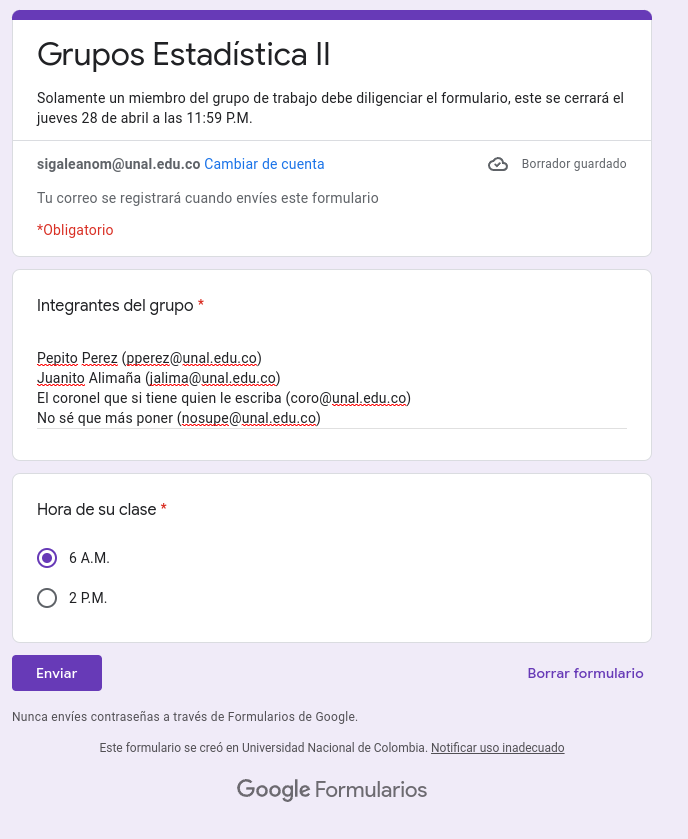

<h1> Repositorio para el curso Estadística II </h1>

En este repositorio van a encontrar todos los códigos de R para generar los resultados de cada práctica.

<b>No</b> se incluye el código para el Dashboard y/o PDF mostrado(s) durante las sesiones de taller.

<h2> Horarios de interés </h2>

<table>
    <thead>
        <tr>
        <th> Evento </th>
        <th> Día(s) </th>
        <th> Horario </th>
        </tr>
    </thead>
    <tbody>
    <tr>
        <td> <a href="https://meet.google.com/gni-zekc-zms" target="_blank">Taller (virtual) </a> </td>
        <td> Lunes </td>
        <td> 18 - 20 </td>
    </tr>
    <tr>
        <td> Asesoría (presencial) </td>
        <td> Miércoles (43-103) </td>
        <td> 14 - 16 </td>
    </tr>
    <tr>
        <td> <a href="https://meet.google.com/uxg-osxn-vwq" target="_blank">Asesoría (virtual)</a> </td>
        <td> Viernes </td>
        <td> 16 - 18 </td>
    </tr>
    </tbody>
</table>

La siguiente es la estructura de las carpetas del repositorio.

<ul>
    <li> Tallern_(fecha de realización del taller). n es el número de la sesion de taller
    <ul> 
        <li> taller. </li>
        <ul> 
            <li>Base de datos (opcional). </li>
            <li> Archivo .Rmd con que genera el pdf del taller.</li>
            <li> Archivo .pdf con el enunciado del taller.</li>
            <li> Respectivo proyecto de R.</li>
        </ul>
        <li> solucion. </li>
        <ul> 
            <li>SolucionSimon</li>
                <ul> 
                    <li> Base de datos (opcional). </li>
                    <li> Archivo .Rmd con que genera el pdf de la solución del taller.</li>
                    <li> Archivo .pdf con la solución del taller.</li>
                    <li> Script con el código de la solución por mí.</li>
                    <li> Respectivo proyecto de R.</li>
                </ul>
            <li>Tallern</li>
                <ul> 
                    <li> Base de datos (opcional). </li>
                    <li> Script con el código de la solución mostrada en la sesión de taller.</li>
                    <li> Respectivo proyecto de R.</li>
                </ul>
        </ul>
    </ul>
</ul>

<b>Nota:</b> cuando se culmine alguna sección del curso, la estructura de carpetas se mantiene dentro de la carpeta de la sección correspondiente.
 
<b>Posdata:</b> en general esa es la estructura de las carpetas, puede variar según surja o se considere necesario. El material de ustedes será subido a la carpeta 2022_1.
 
<h1>Respecto a la encuesta</h1>

Bueeeeeeeeeeeeenas tardes, espero que estén súper bien. Les escribo con intención de comentarles que llegó la hora de dañar la amistad con sus compas, digo, de que trabajen en grupo en el curso (:p es chiste). Los grupos son de máximo cuatro integrantes, los cuales deben ser registrados en la siguiente encuesta.

Link de la encuesta: https://forms.gle/UrE2xLVqhDXGGE8z8

Acá les dejo un ejemplo de llenado de la encuesta.

.

Note que para cada integrante debe estar de la siguiente manera: nombre completo (correo institucional), además, entre el nombre completo y el correo hay un único espacio. Los integrantes deben estar en líneas diferentes así como se muestra en la imagen.

Respecto al horario del curso, seleccione la hora a la que usted y sus compañeros de grupo de trabajo ven la clase, esto quiere decir que todos los integrantes del grupo de trabajo deben pertenecer al mismo grupo del curso.

Que tengan bonita tarde :3

**Posdata** no sé si se pueden hacer solos, pregúntenle primero al profe. 
